# Implementing CI/CD Pipeline for Terraform using Jenkins

In this project we will go into the details of building a robust CI/CD pipeline specifically
tailored for terraform projects. By automating the building, testing and deployment of
infrastructure changes, these pipelines enhance speed, reliability and consistency across
environments. The use of infrastructure as code IaC with terraform ensures reproducibility and
scalability, while jenkins facilitate collaboration development, visibility and continuous
integration and deployment as you will see in this project.

### Dockerfile for Jenkins

Jenkins comes with a docker image that can be used out of the box to run all the relevant dependency
for jenkins. But because we have unique requirements to run terraform, we need to find a way to
extend the readily available jenkins image.

Extending this image means that we have to write our own docker file, and include all the other
stuff we need.

1. create a directory name it terraform-with-cicd
2. we create a file and name it dockerfile
3. then add the below code block

```
 # Use the official Jenkins base image
 FROM jenkins/jenkins:lts

 # Switch to the root user to install additional packages
 USER root

 # Install necessary tools and dependencies (e.g., Git, unzip, wget, software-properties-common)
 RUN apt-get update && apt-get install -y \
     git \
     unzip \
     wget \
     software-properties-common \
     && rm -rf /var/lib/apt/lists/*

 # Install Terraform
 RUN apt-get update && apt-get install -y gnupg software-properties-common wget \
     && wget -O- https://apt.releases.hashicorp.com/gpg | gpg --dearmor | tee /usr/share/keyrings/hashicorp-archive-keyring.gpg \
     && gpg --no-default-keyring --keyring /usr/share/keyrings/hashicorp-archive-keyring.gpg --fingerprint \
     && echo "deb [signed-by=/usr/share/keyrings/hashicorp-archive-keyring.gpg] https://apt.releases.hashicorp.com $(lsb_release -cs) main" | tee /etc/apt/sources.list.d/hashicorp.list \
     && apt-get update && apt-get install -y terraform \
     && rm -rf /var/lib/apt/lists/*

 # Set the working directory
 WORKDIR /app

 # Print Terraform version to verify installation
 RUN terraform --version

 # Switch back to the Jenkins user
 USER jenkins
```

Lets break down the code blocks above.

1. `FROM jenkins/jenkins:lts` Uses the official Jenkins base image

2. `USER root` switch to root user to install additional packages.

3. Install necessary tools and dependencies (eg. Git, unzip, wget, software-properties-common). The
   `apt-get update` command refreshes the package list and `apt-get install` installs the specified
   packages `(git, unzip, wget, software-properties-common)`. The `&&` is used to chain commands and
   `rm -rf /var/lib/apt-lists/*` removes unnecessary package lists helping to reduce the size of the
   docker image.

```
RUN apt-get update && apt-get install -y \
    git \
    unzip \
    wget \
    software-properties-common \
    && rm -rf /var/lib/apt/lists/*
```

4. Install terraform

```
RUN apt-get update && apt-get install -y gnupg software-properties-common wget \
    && wget -O- https://apt.releases.hashicorp.com/gpg | gpg --dearmor | tee /usr/share/keyrings/hashicorp-archive-keyring.gpg \
    && gpg --no-default-keyring --keyring /usr/share/keyrings/hashicorp-archive-keyring.gpg --fingerprint \
    && echo "deb [signed-by=/usr/share/keyrings/hashicorp-archive-keyring.gpg] https://apt.releases.hashicorp.com $(lsb_release -cs) main" | tee /etc/apt/sources.list.d/hashicorp.list \
    && apt-get update && apt-get install -y terraform \
    && rm -rf /var/lib/apt/lists/*
```

This block of code installs terraform, update the package list, install dependencies, adding
HashiCorp's GPG Key, configuring the repository, updating again and finally installing terraform.

### Note :

GPG (GNU Privacy Guard) is a free open source software for encrypting and signing data. In the
context of software distribution, GPG keys are used to verify the integrity and authenticity of
packages.

5. Lets set the working directory, this line set the working directory for subsequent command to
   /app

```
WORKDIR /app
```

6. Print terraform version to confirm installation

run `terraform --version`

7. Switch back to the jenkins user `user jenkins` This lines returns to the jenkins user, returning
   to a lower privilege level.

Now we understand that we clearly want to have a docker container running Jenkins, but also have
terraform installed.Lets build the docker image.

### Building and running the docker image

Our mission is to have a docker container running jerkins, but also have terraform installed.

To build the jenkins image we run the code `docker build -t jenkins-server .` notice the `.` at the
end.

Lets run the image into a docker container
`docker run -d -p 8080:8080 --name jenkins-server jenkins-server`

The code above outputs a hash data

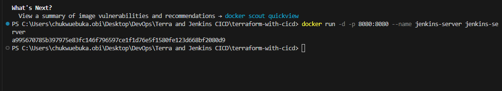

. `docker run`: This is the command used to run a docker container

. `-d`: This flag stands for fetach. it runs the container in the background. allowing us to
continue using the terminal for other commdnas.

. `-p 8080:8080`: This flag maps the port 8080 from the host to the port 8080 inside the container.
The application can be opened in our browser localhost:8080.

. `--name jenkins-server`: This flag assigns a name to the container in this case jenkins-server

. `jenkins-server`: This is the name of the docker image that we just ran.

We can check that the container is running `docker ps`


WE Can also access jenkins server from the web browser on `localhost:8080`

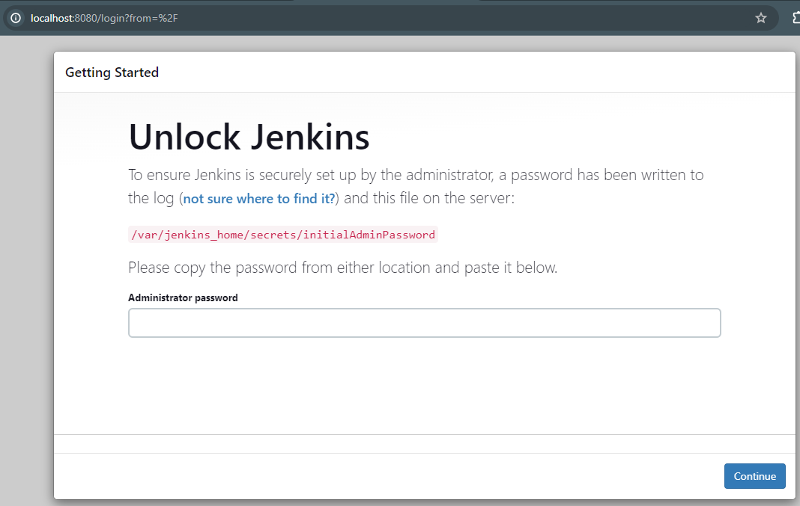

We can access the jenkins server directly inside the container

` docker exec -it 800f8f48466b /bin/bash`

Now lets access the jenkins server directly inside the container

`docker exec -it a995670785b3 /bin/bash`

In details: `docker exec`: This command is used to execute a command in a running docker container
`-it`: these flags are often used together

- `-i` stands for interactive which allows you to interact with the container
- `-t` allocates a pseudo-TTY, or terminal, enabling a more interactive session `a995670785b3` This
  is the container ID or container name. we got it from docker ps ` /bin/bash`: This is the command
  that we want to execute inside the container. In this case its launching an interactive bash shell
  within the specified container.

Next we will retrieve the initial jenkins admin password

`cat /var/jenkins_home/secrets/initialAdminPassword `

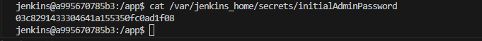

Now we have our jenkins page up and running

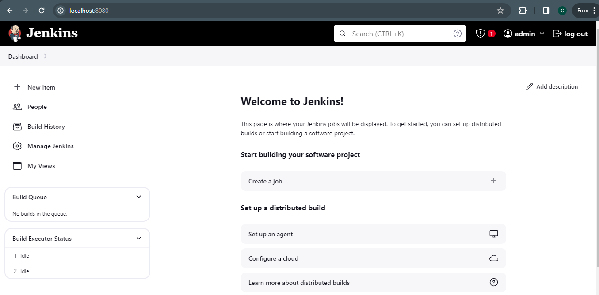

### Set up Git repository with Terraform code

we will do the below to test that our code can create existing resources

1. the provider.tf file has an s3 backend configuration. we will create our own bucket and update
   the code
2. we will push our latest code to Github
3. we will run terraform init, plan and apply ...

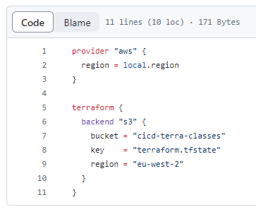

### Connect the Github repository to jenkins

1. we will install jenkins github plugin
2. from manage jenkins > plugins > available plugins
3. search for "Github integration" plugin for installation
4. we will lso install "Terraform plugin" and "AWS Credentials plugin"


### Configure Github credentials in Jenkins

1. jenkins need to know how to connect to github.
2. In github navigate to your github profile then click on settings, next scroll down and click on
   developer settings

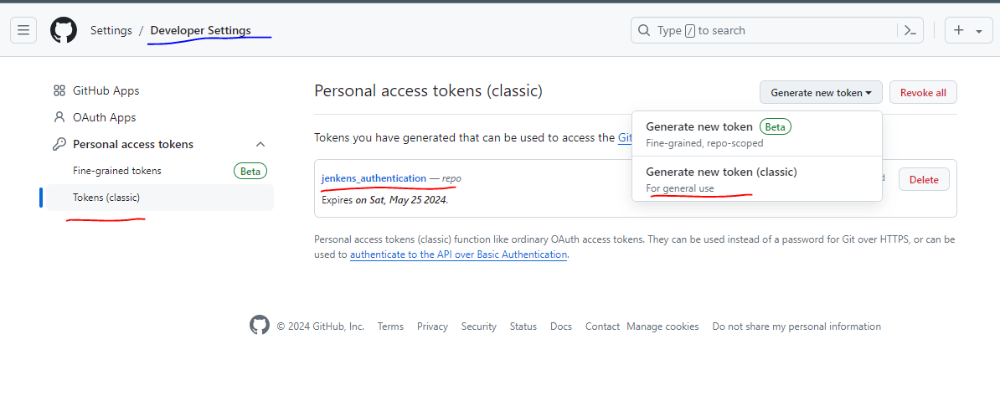

3. In jenkins we will navigate to "manage jenkins" then click on credentials, close to "global" a
   drop down displays, click on it and add credentials

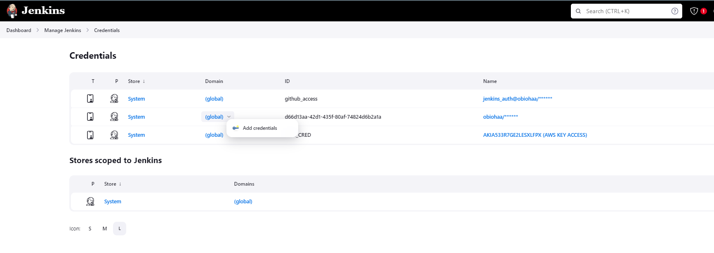

4. Next we will set up jenkins multibranch pipeline:

- from the jenkins dashboard click on "New Item"
- give it name, click on multibranch pipeline then click on ok
- select the type of source of the code and the jenkinsfile

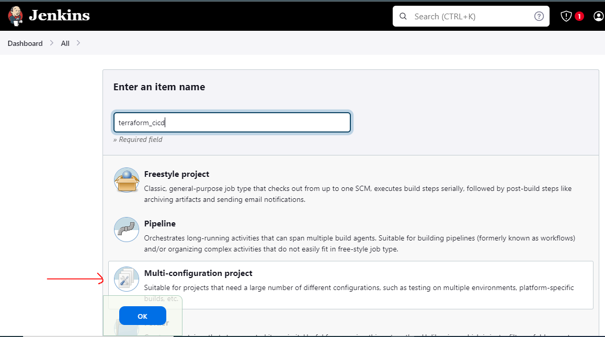

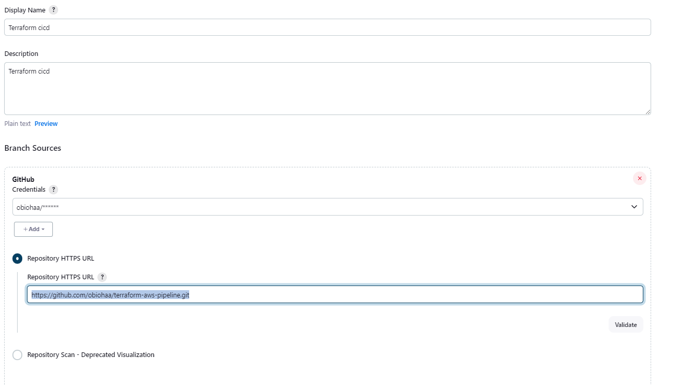 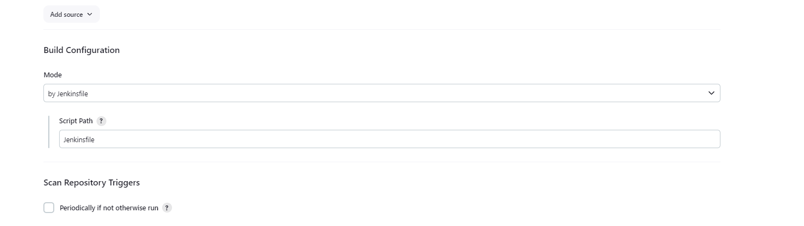

we added this forked repository https://github.com/obiohaa/terraform-aws-pipeline.git so we leave
everything as default and hit apply then save.

Next we scan repository log

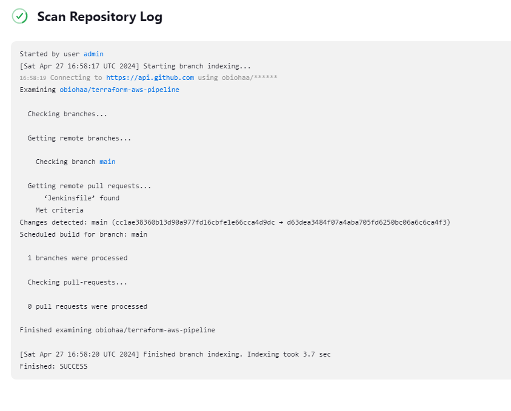

We then click on build now and watched our jenkins file run the terraform plan and apply.


The above step by step is a run through of the jenkinsfile.
